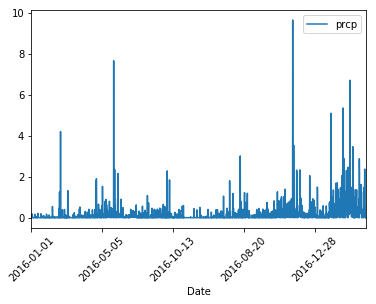
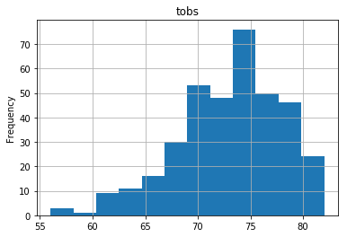
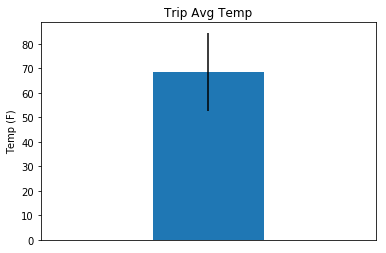

```python
import sqlalchemy
from sqlalchemy.ext.automap import automap_base
from sqlalchemy.orm import Session
from sqlalchemy import create_engine
from sqlalchemy import func
from sqlalchemy import or_
import pandas as pd
import matplotlib.pyplot as plt
import numpy as np
import datetime as dt
```


```python
engine = create_engine("sqlite:///hawaii.sqlite", echo=False)
```


```python
Base = automap_base()
Base.prepare(engine, reflect=True)
Base.classes.keys()
```


    ['measurement', 'station']


```python
m = Base.classes.measurement
s = Base.classes.station
```


```python
session = Session(engine)
```


```python
start = "2017-01-10"
end = "2017-01-20"
qry = session.query(*[m.date,m.prcp]).filter(m.date <= '2017-01-09').\
        filter(m.date >= '2016-01-01').all()
i = pd.DataFrame(qry)
r = pd.DataFrame(qry)
n = r.set_index("date", inplace = True)
qry
```


    [('2016-01-01', 0.0),
     ('2016-01-02', 0.0),
     ('2016-01-03', 0.0),
     ('2016-01-04', 0.0),
     ('2016-01-05', 0.0),
     ('2016-01-06', 0.0),
     ('2016-01-07', 0.18),
     ('2016-01-08', 0.01),
     ('2016-01-09', 0.03),
     ('2016-01-10', 0.01),
     ('2016-01-11', 0.0),
     ('2016-01-12', 0.0),
     ('2016-01-13', 0.0),
     ('2016-01-14', 0.0),
     ('2016-01-15', 0.0),
     ('2016-01-16', 0.01),
     ('2016-01-17', 0.0),
     ('2016-01-18', 0.0),
     ('2016-01-19', 0.0),
     ('2016-01-20', 0.0),
     ('2016-01-21', 0.0),
     ('2016-01-22', 0.0),
     ('2016-01-23', 0.0),
     ('2016-01-24', 0.0),
     ('2016-01-25', 0.04),
     ('2016-01-26', 0.16),
     ('2016-01-27', 0.01),
     ('2016-01-28', 0.0),
     ('2016-01-29', 0.0),
     ('2016-01-30', 0.0),
     ('2016-01-31', 0.0),
     ('2016-02-01', 0.0),
     ('2016-02-02', 0.06),
     ('2016-02-03', 0.0),
     ('2016-02-04', 0.0),
     ('2016-02-05', 0.0),
     ('2016-02-06', 0.0),
     ('2016-02-07', 0.02),
     ('2016-02-08', 0.01),
     ('2016-02-09', 0.0),
     ('2016-02-10', 0.0),
     ('2016-02-11', 0.0),
     ('2016-02-12', 0.02),
     ('2016-02-13', 0.0),
     ('2016-02-14', 0.0),
     ('2016-02-15', 0.0),
     ('2016-02-16', 0.02),
     ('2016-02-17', 0.21),
     ('2016-02-18', 0.02),
     ('2016-02-19', 0.03),
     ('2016-02-20', 0.01),
     ('2016-02-21', 0.0),
     ('2016-02-22', 0.0),
     ('2016-02-23', 0.0),
     ('2016-02-24', 0.0),
     ('2016-02-25', 0.0),
     ('2016-02-26', 0.0),
     ('2016-02-27', 0.0),
     ('2016-02-28', 0.0),
     ('2016-02-29', 0.0),
     ('2016-03-01', 0.0),
     ('2016-03-02', 0.0),
     ('2016-03-03', 0.0),
     ('2016-03-04', 0.0),
     ('2016-03-05', 0.0),
     ('2016-03-06', 0.0),
     ('2016-03-07', 0.0),
     ('2016-03-08', 0.0),
     ('2016-03-09', 0.19),
     ('2016-03-10', 0.0),
     ('2016-03-11', 0.0),
     ('2016-03-12', 0.0),
     ('2016-03-13', 0.0),
     ('2016-03-14', 0.0),
     ('2016-03-15', 0.08),
     ('2016-03-16', 0.05),
     ('2016-03-17', 0.0),
     ('2016-03-18', 0.0),
     ('2016-03-19', 0.0),
     ('2016-03-20', 0.0),
     ('2016-03-21', 0.0),
     ('2016-03-22', 0.0),
     ('2016-03-23', 0.0),
     ('2016-03-24', 0.0),
     ('2016-03-25', 0.01),
     ('2016-03-26', 0.09),
     ('2016-03-27', 0.01),
     ('2016-03-28', 0.0),
     ('2016-03-29', 0.09),
     ('2016-03-30', 0.01),
     ('2016-03-31', 0.0),
     ('2016-04-01', 0.0),
     ('2016-04-02', 0.0),
     ('2016-04-03', 0.0),
     ('2016-04-04', 0.0),
     ('2016-04-05', 0.0),
     ('2016-04-06', 0.01),
     ('2016-04-07', 0.0),
     ('2016-04-08', 0.0),
     ('2016-04-09', 0.0),
     ('2016-04-10', 0.0),
     ('2016-04-11', 0.01),
     ('2016-04-12', 0.0),
     ('2016-04-13', 0.01),
     ('2016-04-14', 0.0),
     ('2016-04-15', 0.0),
     ('2016-04-16', 0.0),
     ('2016-04-17', 0.17),
     ('2016-04-18', 0.15),
     ('2016-04-19', 0.0),
     ('2016-04-20', 0.0),
     ('2016-04-21', 0.0),
     ('2016-04-22', 0.0),
     ('2016-04-23', 0.05),
     ('2016-04-24', 0.05),
     ('2016-04-25', 0.0),
     ('2016-04-26', 0.0),
     ('2016-04-27', 0.0),
     ('2016-04-28', 0.0),
     ('2016-04-29', 0.0),
     ('2016-04-30', 0.0),
     ('2016-05-01', 0.0),
     ('2016-05-02', 0.0),
     ('2016-05-03', 0.01),
     ('2016-05-04', 0.0),
     ('2016-05-05', 0.13),
     ('2016-05-06', 0.0),
     ('2016-05-07', 0.03),
     ('2016-05-08', 0.0),
     ('2016-05-09', 0.0),
     ('2016-05-10', 0.0),
     ('2016-05-11', 0.0),
     ('2016-05-12', 0.0),
     ('2016-05-13', 0.0),
     ('2016-05-14', 0.0),
     ('2016-05-15', 0.02),
     ('2016-05-16', 0.0),
     ('2016-05-17', 0.0),
     ('2016-05-18', 0.0),
     ('2016-05-19', 0.0),
     ('2016-05-20', 0.01),
     ('2016-05-21', 0.03),
     ('2016-05-22', 0.0),
     ('2016-05-23', 0.0),
     ('2016-05-24', 0.0),
     ('2016-05-25', 0.0),
     ('2016-05-26', 0.06),
     ('2016-05-27', 0.0),
     ('2016-05-28', 0.1),
     ('2016-05-29', 0.54),
     ('2016-05-30', 0.16),
     ('2016-05-31', 0.05),
     ('2016-06-01', 0.06),
     ('2016-06-02', 0.0),
     ('2016-06-03', 0.0),
     ('2016-06-04', 0.0),
     ('2016-06-05', 0.0),
     ('2016-06-06', 0.0),
     ('2016-06-07', 0.01),
     ('2016-06-08', 0.0),
     ('2016-06-09', 0.01),
     ('2016-06-10', 0.05),
     ('2016-06-11', 0.0),
     ('2016-06-12', 0.01),
     ('2016-06-13', 0.0),
     ('2016-06-14', 0.0),
     ('2016-06-15', 0.01),
     ('2016-06-16', 0.02),
     ('2016-06-17', 0.02),
     ('2016-06-18', 0.0),
     ('2016-06-19', 0.01),
     ('2016-06-20', 0.01),
     ('2016-06-21', 0.0),
     ('2016-06-22', 0.0),
     ('2016-06-23', 0.0),
     ('2016-06-24', 0.01),
     ('2016-06-25', 0.03),
     ('2016-06-26', 0.01),
     ('2016-06-27', 0.01),
     ('2016-06-28', 0.0),
     ('2016-06-29', 0.0),
     ('2016-06-30', 0.0),
     ('2016-07-01', 0.0),
     ('2016-07-02', 0.0),
     ('2016-07-03', 0.0),
     ('2016-07-04', 0.04),
     ('2016-07-05', 0.02),
     ('2016-07-06', 0.02),
     ('2016-07-07', 0.01),
     ('2016-07-08', 0.0),
     ('2016-07-09', 0.0),
     ('2016-07-10', 0.02),
     ('2016-07-11', 0.0),
     ('2016-07-12', 0.0),
     ('2016-07-13', 0.0),
     ('2016-07-14', 0.0),
     ('2016-07-15', 0.46),
     ('2016-07-16', 0.03),
     ('2016-07-17', 0.0),
     ('2016-07-18', 1.25),
     ('2016-07-19', 0.03),
     ('2016-07-20', 0.0),
     ('2016-07-21', 0.04),
     ('2016-07-22', 0.02),
     ('2016-07-23', 0.0),
     ('2016-07-24', 0.13),
     ('2016-07-25', 4.2),
     ('2016-07-26', 0.0),
     ('2016-07-27', 0.0),
     ('2016-07-28', 0.0),
     ('2016-07-29', 0.0),
     ('2016-07-30', 0.0),
     ('2016-07-31', 0.06),
     ('2016-08-01', 0.08),
     ('2016-08-02', 0.05),
     ('2016-08-03', 0.0),
     ('2016-08-04', 0.04),
     ('2016-08-05', 0.01),
     ('2016-08-06', 0.0),
     ('2016-08-07', 0.39),
     ('2016-08-08', 0.02),
     ('2016-08-09', 0.0),
     ('2016-08-10', 0.0),
     ('2016-08-11', 0.0),
     ('2016-08-12', 0.0),
     ('2016-08-13', 0.0),
     ('2016-08-14', 0.0),
     ('2016-08-15', 0.0),
     ('2016-08-16', 0.0),
     ('2016-08-17', 0.0),
     ('2016-08-18', 0.0),
     ('2016-08-19', 0.04),
     ('2016-08-20', 0.0),
     ('2016-08-21', 0.12),
     ('2016-08-22', 0.4),
     ('2016-08-23', 0.0),
     ('2016-08-24', 0.08),
     ('2016-08-25', 0.08),
     ('2016-08-26', 0.0),
     ('2016-08-27', 0.0),
     ('2016-08-28', 0.01),
     ('2016-08-29', 0.0),
     ('2016-08-30', 0.0),
     ('2016-08-31', 0.13),
     ('2016-09-01', 0.0),
     ('2016-09-02', 0.0),
     ('2016-09-03', 0.0),
     ('2016-09-04', 0.03),
     ('2016-09-05', 0.0),
     ('2016-09-06', 0.0),
     ('2016-09-07', 0.05),
     ('2016-09-08', 0.0),
     ('2016-09-09', 0.03),
     ('2016-09-10', 0.0),
     ('2016-09-11', 0.05),
     ('2016-09-12', 0.0),
     ('2016-09-13', 0.02),
     ('2016-09-14', 1.32),
     ('2016-09-15', 0.42),
     ('2016-09-16', 0.06),
     ('2016-09-17', 0.05),
     ('2016-09-18', 0.0),
     ('2016-09-19', 0.0),
     ('2016-09-20', 0.0),
     ('2016-09-21', 0.0),
     ('2016-09-22', 0.02),
     ('2016-09-23', 0.0),
     ('2016-09-24', 0.0),
     ('2016-09-25', 0.0),
     ('2016-09-26', 0.06),
     ('2016-09-27', 0.02),
     ('2016-09-28', 0.0),
     ('2016-09-29', 0.0),
     ('2016-09-30', 0.0),
     ('2016-10-01', 0.0),
     ('2016-10-02', 0.0),
     ('2016-10-03', 0.0),
     ('2016-10-04', 0.0),
     ('2016-10-05', 0.0),
     ('2016-10-06', 0.0),
     ('2016-10-07', 0.0),
     ('2016-10-08', 0.0),
     ('2016-10-09', 0.0),
     ('2016-10-10', 0.0),
     ('2016-10-11', 0.0),
     ('2016-10-12', 0.0),
     ('2016-10-13', 0.0),
     ('2016-10-14', 0.0),
     ('2016-10-15', 0.0),
     ('2016-10-16', 0.0),
     ('2016-10-17', 0.01),
     ('2016-10-18', 0.0),
     ('2016-10-19', 0.0),
     ('2016-10-20', 0.0),
     ('2016-10-21', 0.05),
     ('2016-10-22', 0.15),
     ('2016-10-23', 0.01),
     ('2016-10-24', 0.0),
     ('2016-10-25', 0.03),
     ('2016-10-26', 0.0),
     ('2016-10-27', 0.0),
     ('2016-10-28', 0.0),
     ('2016-10-29', 0.0),
     ('2016-10-30', 0.24),
     ('2016-10-31', 0.03),
     ('2016-11-01', 0.0),
     ('2016-11-02', 0.0),
     ('2016-11-03', 0.0),
     ('2016-11-04', 0.0),
     ('2016-11-05', 0.0),
     ('2016-11-06', 0.0),
     ('2016-11-07', 0.0),
     ('2016-11-08', 0.07),
     ('2016-11-09', 0.0),
     ('2016-11-10', 0.0),
     ('2016-11-11', 0.0),
     ('2016-11-12', 0.0),
     ('2016-11-13', 0.0),
     ('2016-11-14', 0.0),
     ('2016-11-15', 0.0),
     ('2016-11-16', 0.0),
     ('2016-11-17', 0.0),
     ('2016-11-18', 0.0),
     ('2016-11-19', 0.03),
     ('2016-11-20', 0.05),
     ('2016-11-21', 0.01),
     ('2016-11-22', 0.13),
     ('2016-11-23', 0.14),
     ('2016-11-24', 0.05),
     ('2016-11-25', 0.05),
     ('2016-11-26', 0.05),
     ('2016-11-27', 0.0),
     ('2016-11-28', 0.01),
     ('2016-11-29', 0.0),
     ('2016-11-30', 0.14),
     ('2016-12-01', 0.12),
     ('2016-12-02', 0.03),
     ('2016-12-03', 0.0),
     ('2016-12-04', 0.03),
     ('2016-12-05', 0.43),
     ('2016-12-06', 0.02),
     ('2016-12-07', 0.0),
     ('2016-12-08', 0.03),
     ('2016-12-09', 0.52),
     ('2016-12-10', 0.05),
     ('2016-12-11', 0.04),
     ('2016-12-12', 0.01),
     ('2016-12-13', 0.05),
     ('2016-12-14', 0.03),
     ('2016-12-15', 0.0),
     ('2016-12-16', 0.0),
     ('2016-12-17', 0.01),
     ('2016-12-18', 0.13),
     ('2016-12-19', 0.01),
     ('2016-12-20', 0.0),
     ('2016-12-21', 0.0),
     ('2016-12-22', 0.01),
     ('2016-12-23', 0.01),
     ('2016-12-24', 0.01),
     ('2016-12-25', 0.0),
     ('2016-12-26', 0.02),
     ('2016-12-27', 0.0),
     ('2016-12-28', 0.02),
     ('2016-12-29', 0.04),
     ('2016-12-30', 0.12),
     ('2016-12-31', 0.01),
     ('2017-01-01', 0.0),
     ('2017-01-02', 0.0),
     ('2017-01-03', 0.0),
     ('2017-01-04', 0.0),
     ('2017-01-05', 0.0),
     ('2017-01-06', 0.0),
     ('2017-01-07', 0.0),
     ('2017-01-08', 0.0),
     ('2017-01-09', 0.0),
     ('2016-01-01', 0.02),
     ('2016-01-02', 0.01),
     ('2016-01-03', 0.0),
     ('2016-01-04', 0.0),
     ('2016-01-05', 0.19),
     ('2016-01-06', 0.3),
     ('2016-01-07', 0.03),
     ('2016-01-08', 0.01),
     ('2016-01-09', 0.0),
     ('2016-01-10', 0.01),
     ('2016-01-11', 0.01),
     ('2016-01-12', 0.03),
     ('2016-01-13', 0.0),
     ('2016-01-14', 0.0),
     ('2016-01-15', 0.0),
     ('2016-01-16', 0.03),
     ('2016-01-17', 0.02),
     ('2016-01-18', 0.0),
     ('2016-01-19', 0.0),
     ('2016-01-20', 0.02),
     ('2016-01-21', 0.27),
     ('2016-01-22', 0.01),
     ('2016-01-23', 0.0),
     ('2016-01-24', 0.0),
     ('2016-01-25', 0.13),
     ('2016-01-26', 0.16),
     ('2016-01-27', 0.0),
     ('2016-01-28', 0.0),
     ('2016-01-29', 0.0),
     ('2016-01-30', 0.0),
     ('2016-01-31', 0.0),
     ('2016-02-01', 0.0),
     ('2016-02-02', 0.41),
     ('2016-02-03', 0.25),
     ('2016-02-04', 0.0),
     ('2016-02-05', 0.0),
     ('2016-02-06', 0.0),
     ('2016-02-07', 0.16),
     ('2016-02-08', 0.0),
     ('2016-02-09', 0.0),
     ('2016-02-10', 0.0),
     ('2016-02-11', 0.0),
     ('2016-02-12', 0.07),
     ('2016-02-13', 0.02),
     ('2016-02-14', 0.0),
     ('2016-02-15', 0.0),
     ('2016-02-16', 0.05),
     ('2016-02-17', 0.1),
     ('2016-02-18', 0.02),
     ('2016-02-19', 0.11),
     ('2016-02-20', 0.07),
     ('2016-02-21', 0.09),
     ('2016-02-22', 0.05),
     ('2016-02-23', 0.0),
     ('2016-02-24', 0.0),
     ('2016-02-25', 0.0),
     ('2016-02-26', 0.38),
     ('2016-02-27', 0.08),
     ('2016-02-28', 0.0),
     ('2016-02-29', 0.0),
     ('2016-03-01', 0.0),
     ('2016-03-02', 0.0),
     ('2016-03-03', 0.0),
     ('2016-03-04', 0.0),
     ('2016-03-05', 0.0),
     ('2016-03-06', 0.0),
     ('2016-03-07', 0.0),
     ('2016-03-08', 0.02),
     ('2016-03-09', 0.15),
     ('2016-03-10', 0.0),
     ('2016-03-11', 0.06),
     ('2016-03-12', 0.0),
     ('2016-03-13', 0.0),
     ('2016-03-14', 0.0),
     ('2016-03-15', 0.3),
     ('2016-03-16', 0.41),
     ('2016-03-17', 0.02),
     ('2016-03-18', 0.03),
     ('2016-03-19', 0.02),
     ('2016-03-20', 0.0),
     ('2016-03-21', 0.06),
     ('2016-03-22', 0.0),
     ('2016-03-23', 1.78),
     ('2016-03-24', 0.02),
     ('2016-03-25', 1.9),
     ('2016-03-26', 0.87),
     ('2016-03-27', 0.01),
     ('2016-03-28', 0.0),
     ('2016-03-29', 0.01),
     ('2016-03-30', 0.02),
     ('2016-03-31', 0.0),
     ('2016-04-01', 0.0),
     ('2016-04-02', 0.02),
     ('2016-04-03', 0.0),
     ('2016-04-04', 0.0),
     ('2016-04-05', 0.2),
     ('2016-04-06', 0.1),
     ('2016-04-07', 0.12),
     ('2016-04-08', 0.02),
     ('2016-04-09', 0.66),
     ('2016-04-10', 0.02),
     ('2016-04-11', 0.08),
     ('2016-04-12', 0.02),
     ('2016-04-13', 0.05),
     ('2016-04-14', 0.06),
     ('2016-04-15', 0.0),
     ('2016-04-16', 0.04),
     ('2016-04-17', 0.17),
     ('2016-04-18', 0.4),
     ('2016-04-19', 0.02),
     ('2016-04-20', 0.0),
     ('2016-04-21', 0.01),
     ('2016-04-22', 0.0),
     ('2016-04-23', 0.21),
     ('2016-04-24', 0.11),
     ('2016-04-25', 0.06),
     ('2016-04-26', 0.01),
     ('2016-04-27', 0.05),
     ('2016-04-28', 0.0),
     ('2016-04-29', 0.0),
     ('2016-04-30', 0.0),
     ('2016-05-01', 0.04),
     ('2016-05-02', 0.0),
     ('2016-05-03', 0.02),
     ('2016-05-04', 0.12),
     ('2016-05-05', 0.6),
     ('2016-05-06', 0.22),
     ('2016-05-07', 1.53),
     ('2016-05-08', 0.8),
     ('2016-05-09', 0.1),
     ('2016-05-10', 0.15),
     ('2016-05-11', 0.02),
     ('2016-05-12', 0.0),
     ('2016-05-13', 0.0),
     ('2016-05-14', 0.18),
     ('2016-05-15', 0.02),
     ('2016-05-16', 0.0),
     ('2016-05-17', 0.03),
     ('2016-05-18', 0.05),
     ('2016-05-19', 0.05),
     ('2016-05-20', 0.15),
     ('2016-05-21', 0.08),
     ('2016-05-22', 0.0),
     ('2016-05-23', 0.0),
     ('2016-05-24', 0.0),
     ('2016-05-25', 0.0),
     ('2016-05-26', 0.8),
     ('2016-05-27', 0.05),
     ('2016-05-28', 0.0),
     ('2016-05-29', 0.0),
     ('2016-05-30', 0.03),
     ('2016-05-31', 0.18),
     ('2016-06-01', 0.89),
     ('2016-06-02', 0.15),
     ('2016-06-03', 0.16),
     ('2016-06-04', 0.0),
     ('2016-06-05', 0.63),
     ('2016-06-06', 0.36),
     ('2016-06-07', 0.4),
     ('2016-06-08', 0.0),
     ('2016-06-09', 0.21),
     ('2016-06-10', 0.06),
     ('2016-06-11', 0.02),
     ('2016-06-12', 0.04),
     ('2016-06-13', 0.08),
     ('2016-06-14', 0.06),
     ('2016-06-15', 0.18),
     ('2016-06-16', 0.03),
     ('2016-06-17', 0.16),
     ('2016-06-18', 0.3),
     ('2016-06-19', 0.02),
     ('2016-06-20', 0.16),
     ('2016-06-21', 0.03),
     ('2016-06-22', 0.01),
     ('2016-06-23', 0.25),
     ('2016-06-24', 0.02),
     ('2016-06-25', 0.8),
     ('2016-06-26', 0.06),
     ('2016-06-27', 0.06),
     ('2016-06-28', 0.02),
     ('2016-06-29', 0.03),
     ('2016-06-30', 0.0),
     ('2016-07-01', 0.0),
     ('2016-07-02', 0.0),
     ('2016-07-03', 0.0),
     ('2016-07-04', 0.14),
     ('2016-07-05', 0.05),
     ('2016-07-06', 0.49),
     ('2016-07-07', 0.05),
     ('2016-07-08', 0.03),
     ('2016-07-09', 0.0),
     ('2016-07-10', 0.14),
     ('2016-07-11', 0.11),
     ('2016-07-12', 0.05),
     ('2016-07-13', 0.06),
     ('2016-07-14', 0.43),
     ('2016-07-15', 0.23),
     ('2016-07-16', 0.44),
     ('2016-07-17', 0.03),
     ('2016-07-18', 0.26),
     ('2016-07-19', 0.08),
     ('2016-07-20', 0.0),
     ('2016-07-21', 0.04),
     ('2016-07-22', 0.06),
     ('2016-07-23', 0.16),
     ('2016-07-24', 0.15),
     ('2016-07-25', 7.65),
     ('2016-07-26', 0.0),
     ('2016-07-27', 0.02),
     ('2016-07-28', 0.0),
     ('2016-07-29', 0.0),
     ('2016-07-30', 0.03),
     ('2016-07-31', 0.05),
     ('2016-08-01', 2.35),
     ('2016-08-02', 0.2),
     ('2016-08-03', 0.02),
     ('2016-08-04', 0.62),
     ('2016-08-05', 0.03),
     ('2016-08-06', 0.07),
     ('2016-08-07', 0.3),
     ('2016-08-08', 0.33),
     ('2016-08-09', 0.0),
     ('2016-08-10', 0.0),
     ('2016-08-11', 0.04),
     ('2016-08-12', 0.05),
     ('2016-08-13', 0.0),
     ('2016-08-14', 0.17),
     ('2016-08-15', 0.17),
     ('2016-08-16', 0.1),
     ('2016-08-17', 0.0),
     ('2016-08-18', 0.0),
     ('2016-08-19', 0.14),
     ('2016-08-20', 0.03),
     ('2016-08-21', 0.32),
     ('2016-08-22', 0.94),
     ('2016-08-23', 0.15),
     ('2016-08-24', 2.15),
     ('2016-08-25', 0.08),
     ('2016-08-26', 0.03),
     ('2016-08-27', 0.18),
     ('2016-08-28', 0.14),
     ('2016-08-29', 0.17),
     ('2016-08-30', 0.0),
     ('2016-08-31', 0.1),
     ('2016-09-01', 0.0),
     ('2016-09-02', 0.02),
     ('2016-09-03', 0.07),
     ('2016-09-04', 0.03),
     ('2016-09-05', 0.11),
     ('2016-09-06', 0.05),
     ('2016-09-07', 0.1),
     ('2016-09-08', 0.22),
     ('2016-09-09', 0.01),
     ('2016-09-10', 0.01),
     ('2016-09-11', 0.18),
     ('2016-09-12', 0.04),
     ('2016-09-13', 0.37),
     ('2016-09-14', 0.9),
     ('2016-09-15', 0.12),
     ('2016-09-16', 0.01),
     ('2016-09-17', 0.04),
     ('2016-09-18', 0.0),
     ('2016-09-19', 0.01),
     ('2016-09-20', 0.09),
     ('2016-09-21', 0.06),
     ('2016-09-22', 0.09),
     ('2016-09-23', 0.15),
     ('2016-09-24', 0.0),
     ('2016-09-25', 0.02),
     ('2016-09-26', 0.06),
     ('2016-09-27', 0.12),
     ('2016-09-28', 0.08),
     ('2016-09-29', 0.49),
     ('2016-09-30', 0.31),
     ('2016-10-01', 0.14),
     ('2016-10-02', 0.02),
     ('2016-10-03', 0.04),
     ('2016-10-04', 0.0),
     ('2016-10-05', 0.0),
     ('2016-10-06', 0.05),
     ('2016-10-07', 0.0),
     ('2016-10-08', 0.0),
     ('2016-10-09', 0.0),
     ('2016-10-10', 0.0),
     ('2016-10-11', 0.02),
     ('2016-10-12', 0.03),
     ('2016-10-13', 0.0),
     ('2016-10-14', 0.0),
     ('2016-10-15', 0.0),
     ('2016-10-16', 0.0),
     ('2016-10-17', 0.03),
     ('2016-10-18', 0.05),
     ('2016-10-19', 0.06),
     ('2016-10-20', 0.0),
     ('2016-10-21', 0.15),
     ('2016-10-22', 0.1),
     ('2016-10-23', 0.01),
     ('2016-10-24', 0.0),
     ('2016-10-25', 0.04),
     ('2016-10-26', 0.06),
     ('2016-10-27', 0.11),
     ('2016-10-28', 0.02),
     ('2016-10-29', 0.02),
     ('2016-10-30', 0.1),
     ('2016-10-31', 0.03),
     ('2016-11-01', 0.01),
     ('2016-11-02', 0.0),
     ('2016-11-03', 0.0),
     ('2016-11-04', 0.0),
     ('2016-11-05', 0.02),
     ('2016-11-06', 0.02),
     ('2016-11-07', 0.0),
     ('2016-11-08', 0.14),
     ('2016-11-09', 0.08),
     ('2016-11-10', 0.0),
     ('2016-11-11', 0.0),
     ('2016-11-12', 0.0),
     ('2016-11-13', 0.0),
     ('2016-11-14', 0.06),
     ('2016-11-15', 0.0),
     ('2016-11-16', 0.14),
     ('2016-11-17', 0.03),
     ('2016-11-18', 0.01),
     ('2016-11-19', 0.11),
     ('2016-11-20', 0.11),
     ('2016-11-21', 0.02),
     ('2016-11-22', 0.41),
     ('2016-11-23', 0.03),
     ('2016-11-24', 0.2),
     ('2016-11-25', 0.05),
     ('2016-11-26', 0.05),
     ('2016-11-27', 0.06),
     ('2016-11-28', 0.02),
     ('2016-11-29', 0.04),
     ('2016-11-30', 0.05),
     ('2016-12-01', 0.33),
     ('2016-12-02', 0.3),
     ('2016-12-03', 0.04),
     ('2016-12-04', 0.1),
     ('2016-12-05', 0.34),
     ('2016-12-06', 0.02),
     ('2016-12-07', 0.17),
     ('2016-12-08', 0.03),
     ('2016-12-09', 0.34),
     ('2016-12-10', 0.02),
     ('2016-12-11', 0.02),
     ('2016-12-12', 0.01),
     ('2016-12-13', 0.1),
     ('2016-12-14', 0.05),
     ('2016-12-15', 0.02),
     ('2016-12-16', 0.01),
     ('2016-12-17', 0.11),
     ('2016-12-18', 0.29),
     ('2016-12-19', 0.21),
     ('2016-12-20', 0.02),
     ('2016-12-21', 0.03),
     ('2016-12-22', 0.17),
     ('2016-12-23', 0.1),
     ('2016-12-24', 0.14),
     ('2016-12-25', 0.03),
     ('2016-12-26', 0.26),
     ('2016-12-27', 0.03),
     ('2016-12-28', 0.09),
     ('2016-12-29', 0.18),
     ('2016-12-30', 0.21),
     ('2016-12-31', 0.62),
     ('2017-01-01', 0.29),
     ('2017-01-02', 0.0),
     ('2017-01-03', 0.0),
     ('2017-01-04', 0.0),
     ('2017-01-05', 0.0),
     ('2017-01-06', 0.0),
     ('2017-01-07', 0.06),
     ('2017-01-08', 0.0),
     ('2017-01-09', 0.0),
     ('2016-01-01', 0.0),
     ('2016-01-02', 0.05),
     ('2016-01-03', 0.0),
     ('2016-01-04', 0.0),
     ('2016-01-05', 0.1),
     ('2016-01-06', 0.04),
     ('2016-01-07', 0.03),
     ('2016-01-08', 0.0),
     ('2016-01-09', 0.0),
     ('2016-01-11', 0.0),
     ('2016-01-12', 0.32),
     ('2016-01-13', 0.0),
     ('2016-01-14', 0.0),
     ('2016-01-15', 0.15),
     ('2016-01-16', 0.05),
     ('2016-01-17', 0.0),
     ('2016-01-18', 0.0),
     ('2016-01-19', 0.0),
     ('2016-01-20', 0.05),
     ('2016-01-21', 0.23),
     ('2016-01-22', 0.0),
     ('2016-01-23', 0.0),
     ('2016-01-24', 0.0),
     ('2016-01-25', 0.01),
     ('2016-01-26', 0.0),
     ('2016-01-27', 0.0),
     ('2016-01-28', 0.0),
     ('2016-01-29', 0.13),
     ('2016-01-30', 0.0),
     ('2016-02-01', 0.0),
     ('2016-02-02', 0.2),
     ('2016-02-04', 0.0),
     ('2016-02-05', 0.0),
     ('2016-02-06', 0.0),
     ('2016-02-07', 0.56),
     ('2016-02-08', 0.0),
     ('2016-02-09', 0.0),
     ('2016-02-10', 0.0),
     ('2016-02-11', 0.0),
     ('2016-02-12', 0.0),
     ('2016-02-13', 0.0),
     ('2016-02-14', 0.0),
     ('2016-02-15', 0.23),
     ('2016-02-16', 0.03),
     ('2016-02-17', 0.13),
     ('2016-02-18', 0.0),
     ('2016-02-19', 0.09),
     ('2016-02-20', 0.09),
     ('2016-02-22', 0.0),
     ('2016-02-23', 0.0),
     ('2016-02-24', 0.0),
     ('2016-02-25', 0.0),
     ('2016-02-26', 0.36),
     ('2016-02-27', 0.0),
     ('2016-02-28', 0.0),
     ('2016-02-29', 0.05),
     ('2016-03-01', 0.07),
     ('2016-03-02', 0.0),
     ('2016-03-03', 0.0),
     ('2016-03-04', 0.0),
     ('2016-03-05', 0.0),
     ('2016-03-06', 0.0),
     ('2016-03-07', 0.0),
     ('2016-03-08', 0.0),
     ('2016-03-09', 0.22),
     ('2016-03-10', 0.0),
     ('2016-03-11', 0.01),
     ('2016-03-12', 0.0),
     ('2016-03-14', 0.0),
     ('2016-03-15', 1.08),
     ('2016-03-16', 0.06),
     ('2016-03-17', 0.0),
     ('2016-03-18', 0.13),
     ('2016-03-19', 0.03),
     ('2016-03-20', 0.0),
     ('2016-03-21', 0.0),
     ('2016-03-22', 0.0),
     ('2016-03-23', 0.72),
     ('2016-03-24', 0.0),
     ('2016-03-25', 0.04),
     ('2016-03-26', 0.02),
     ('2016-03-28', 0.0),
     ('2016-03-29', 0.0),
     ('2016-03-30', 0.0),
     ('2016-03-31', 0.0),
     ('2016-04-01', 0.0),
     ('2016-04-02', 0.0),
     ('2016-04-03', 0.0),
     ('2016-04-04', 0.0),
     ('2016-04-05', 0.04),
     ('2016-04-06', 0.08),
     ('2016-04-07', 0.06),
     ('2016-04-08', 0.0),
     ('2016-04-09', 0.14),
     ('2016-04-10', 0.06),
     ('2016-04-11', 0.04),
     ('2016-04-12', 0.0),
     ('2016-04-13', 0.03),
     ('2016-04-14', 0.02),
     ('2016-04-15', 0.03),
     ('2016-04-17', 0.0),
     ('2016-04-18', 0.46),
     ('2016-04-19', 0.0),
     ('2016-04-20', 0.03),
     ('2016-04-21', 0.02),
     ('2016-04-22', 0.0),
     ('2016-04-23', 0.1),
     ('2016-04-24', 0.01),
     ('2016-04-25', 0.0),
     ('2016-04-26', 0.01),
     ('2016-04-27', 0.1),
     ('2016-04-28', 0.0),
     ('2016-04-29', 0.0),
     ('2016-04-30', 0.08),
     ('2016-05-01', 0.01),
     ('2016-05-02', 0.11),
     ('2016-05-03', 0.03),
     ('2016-05-04', 0.36),
     ('2016-05-05', 0.41),
     ('2016-05-09', 0.0),
     ('2016-05-10', 0.15),
     ('2016-05-11', 0.0),
     ('2016-05-12', 0.0),
     ('2016-05-13', 0.0),
     ('2016-05-15', 0.0),
     ('2016-05-16', 0.0),
     ('2016-05-17', 0.0),
     ('2016-05-18', 0.36),
     ('2016-05-19', 0.0),
     ('2016-05-20', 0.04),
     ('2016-05-21', 0.04),
     ('2016-05-22', 0.04),
     ('2016-05-23', 0.11),
     ('2016-05-24', 0.0),
     ('2016-05-25', 0.05),
     ('2016-05-26', 0.35),
     ('2016-05-27', 0.09),
     ('2016-05-28', 0.04),
     ('2016-05-29', 0.0),
     ('2016-05-30', 0.0),
     ('2016-05-31', 0.42),
     ('2016-06-01', 0.22),
     ('2016-06-02', 0.35),
     ('2016-06-03', 0.02),
     ('2016-06-07', 0.0),
     ('2016-06-08', 0.0),
     ('2016-06-09', 0.12),
     ('2016-06-10', 0.13),
     ('2016-06-11', 0.01),
     ('2016-06-12', 0.26),
     ('2016-06-13', 0.01),
     ('2016-06-14', 0.0),
     ('2016-06-15', 0.18),
     ('2016-06-16', 0.06),
     ('2016-06-17', 0.17),
     ('2016-06-18', 0.03),
     ('2016-06-19', 0.03),
     ('2016-06-20', 0.47),
     ('2016-06-21', 0.0),
     ('2016-06-22', 0.08),
     ('2016-06-23', 0.1),
     ('2016-06-24', 0.03),
     ('2016-06-25', 0.44),
     ('2016-06-26', 0.03),
     ('2016-06-27', 0.0),
     ('2016-06-28', 0.0),
     ('2016-06-29', 0.06),
     ('2016-06-30', 0.0),
     ('2016-07-01', 0.0),
     ('2016-07-04', 0.0),
     ('2016-07-05', 0.0),
     ('2016-07-06', 0.2),
     ('2016-07-07', 0.19),
     ('2016-07-08', 0.05),
     ('2016-07-09', 0.0),
     ('2016-07-10', 0.12),
     ('2016-07-11', 0.0),
     ('2016-07-12', 0.03),
     ('2016-07-13', 0.05),
     ('2016-07-14', 0.38),
     ('2016-07-15', 0.43),
     ('2016-07-16', 0.65),
     ('2016-07-18', 0.0),
     ('2016-07-19', 0.43),
     ('2016-07-20', 0.0),
     ('2016-07-22', 0.0),
     ('2016-07-25', 0.0),
     ('2016-07-27', 0.0),
     ('2016-07-28', 0.05),
     ('2016-07-29', 0.01),
     ('2016-08-01', 0.0),
     ('2016-08-02', 0.55),
     ('2016-08-03', 0.0),
     ('2016-08-06', 0.0),
     ('2016-08-07', 0.48),
     ('2016-08-08', 0.01),
     ('2016-08-09', 0.0),
     ('2016-08-10', 0.0),
     ('2016-08-11', 0.0),
     ('2016-08-12', 0.12),
     ('2016-08-13', 0.0),
     ('2016-08-15', 0.0),
     ('2016-08-16', 0.02),
     ('2016-08-17', 0.0),
     ('2016-08-18', 0.01),
     ('2016-08-19', 0.07),
     ('2016-08-20', 0.0),
     ('2016-08-22', 0.0),
     ('2016-08-23', 0.05),
     ('2016-08-24', 2.28),
     ('2016-08-25', 0.0),
     ('2016-08-26', 0.02),
     ('2016-08-27', 0.02),
     ('2016-08-28', 0.14),
     ('2016-08-29', 0.04),
     ('2016-08-31', 0.0),
     ('2016-09-01', 0.0),
     ('2016-09-02', 0.19),
     ('2016-09-05', 0.0),
     ('2016-09-06', 0.04),
     ('2016-09-07', 0.23),
     ('2016-09-08', 0.01),
     ('2016-09-09', 0.29),
     ('2016-09-12', 0.0),
     ('2016-09-13', 0.32),
     ('2016-09-14', 1.84),
     ('2016-09-15', 0.07),
     ('2016-09-16', 0.07),
     ('2016-09-19', 0.0),
     ('2016-09-20', 0.25),
     ('2016-09-21', 0.02),
     ('2016-09-22', 0.17),
     ('2016-09-23', 0.15),
     ('2016-09-24', 0.0),
     ('2016-09-25', 0.0),
     ('2016-09-26', 0.02),
     ('2016-09-27', 0.0),
     ('2016-09-28', 0.0),
     ('2016-09-29', 0.2),
     ('2016-09-30', 0.06),
     ('2016-10-01', 0.08),
     ('2016-10-02', 0.03),
     ('2016-10-03', 0.03),
     ('2016-10-04', 0.0),
     ('2016-10-05', 0.0),
     ('2016-10-06', 0.0),
     ('2016-10-07', 0.0),
     ('2016-10-10', 0.0),
     ('2016-10-11', 0.04),
     ('2016-10-12', 0.0),
     ...]


```python
r.plot()
plt.xticks(rotation=45)
plt.xlabel("Date")
plt.show()
```





```python
r.describe()
```


<div>
<style>
    .dataframe thead tr:only-child th {
        text-align: right;
    }

    .dataframe thead th {
        text-align: left;
    }

    .dataframe tbody tr th {
        vertical-align: top;
    }
</style>
<table border="1" class="dataframe">
  <thead>
    <tr style="text-align: right;">
      <th></th>
      <th>prcp</th>
    </tr>
  </thead>
  <tbody>
    <tr>
      <th>count</th>
      <td>2363.000000</td>
    </tr>
    <tr>
      <th>mean</th>
      <td>0.158493</td>
    </tr>
    <tr>
      <th>std</th>
      <td>0.477564</td>
    </tr>
    <tr>
      <th>min</th>
      <td>0.000000</td>
    </tr>
    <tr>
      <th>25%</th>
      <td>0.000000</td>
    </tr>
    <tr>
      <th>50%</th>
      <td>0.010000</td>
    </tr>
    <tr>
      <th>75%</th>
      <td>0.120000</td>
    </tr>
    <tr>
      <th>max</th>
      <td>9.640000</td>
    </tr>
  </tbody>
</table>
</div>


```python
session.query(func.count(s.station)).scalar()
```


    9


```python
session.query(*[m.station, func.count(m.station)]).group_by(m.station).order_by(func.count(m.station).desc()).all()
```


    [('USC00519281', 2772),
     ('USC00519397', 2724),
     ('USC00513117', 2709),
     ('USC00519523', 2669),
     ('USC00516128', 2612),
     ('USC00514830', 2202),
     ('USC00511918', 1979),
     ('USC00517948', 1372),
     ('USC00518838', 511)]


```python
start = "2016-01-10"
end = "2017-01-10"

tt = session.query(*[m.date, m.tobs]).\
        filter(m.date <= end).\
        filter(m.date >= start).\
        filter(or_(m.station == 'USC00519281')).\
        all()
tt
```


    [('2016-01-10', 74),
     ('2016-01-11', 73),
     ('2016-01-12', 75),
     ('2016-01-13', 74),
     ('2016-01-14', 66),
     ('2016-01-15', 71),
     ('2016-01-16', 73),
     ('2016-01-17', 75),
     ('2016-01-18', 63),
     ('2016-01-19', 61),
     ('2016-01-20', 62),
     ('2016-01-21', 65),
     ('2016-01-22', 65),
     ('2016-01-23', 75),
     ('2016-01-24', 78),
     ('2016-01-25', 69),
     ('2016-01-26', 65),
     ('2016-01-27', 69),
     ('2016-01-28', 64),
     ('2016-01-29', 68),
     ('2016-01-30', 73),
     ('2016-01-31', 74),
     ('2016-02-01', 69),
     ('2016-02-02', 68),
     ('2016-02-03', 69),
     ('2016-02-04', 65),
     ('2016-02-05', 67),
     ('2016-02-06', 69),
     ('2016-02-07', 70),
     ('2016-02-08', 56),
     ('2016-02-09', 57),
     ('2016-02-10', 58),
     ('2016-02-11', 61),
     ('2016-02-12', 71),
     ('2016-02-13', 74),
     ('2016-02-14', 71),
     ('2016-02-15', 75),
     ('2016-02-16', 72),
     ('2016-02-17', 71),
     ('2016-02-18', 72),
     ('2016-02-19', 69),
     ('2016-02-20', 71),
     ('2016-02-21', 72),
     ('2016-02-22', 60),
     ('2016-02-23', 69),
     ('2016-02-24', 67),
     ('2016-02-25', 64),
     ('2016-02-26', 69),
     ('2016-02-27', 69),
     ('2016-02-28', 71),
     ('2016-02-29', 69),
     ('2016-03-01', 72),
     ('2016-03-02', 63),
     ('2016-03-03', 63),
     ('2016-03-04', 62),
     ('2016-03-05', 70),
     ('2016-03-06', 72),
     ('2016-03-07', 67),
     ('2016-03-08', 74),
     ('2016-03-09', 66),
     ('2016-03-10', 68),
     ('2016-03-11', 68),
     ('2016-03-12', 72),
     ('2016-03-13', 72),
     ('2016-03-14', 71),
     ('2016-03-15', 70),
     ('2016-03-16', 68),
     ('2016-03-17', 68),
     ('2016-03-18', 68),
     ('2016-03-19', 68),
     ('2016-03-20', 71),
     ('2016-03-21', 66),
     ('2016-03-22', 65),
     ('2016-03-23', 63),
     ('2016-03-24', 64),
     ('2016-03-25', 72),
     ('2016-03-26', 76),
     ('2016-03-27', 76),
     ('2016-03-28', 73),
     ('2016-03-29', 72),
     ('2016-03-30', 62),
     ('2016-03-31', 65),
     ('2016-04-01', 68),
     ('2016-04-02', 74),
     ('2016-04-03', 74),
     ('2016-04-04', 74),
     ('2016-04-05', 65),
     ('2016-04-06', 69),
     ('2016-04-07', 65),
     ('2016-04-08', 68),
     ('2016-04-09', 74),
     ('2016-04-10', 70),
     ('2016-04-11', 71),
     ('2016-04-12', 74),
     ('2016-04-13', 75),
     ('2016-04-14', 73),
     ('2016-04-15', 74),
     ('2016-04-16', 76),
     ('2016-04-17', 71),
     ('2016-04-18', 68),
     ('2016-04-19', 67),
     ('2016-04-20', 72),
     ('2016-04-21', 73),
     ('2016-04-22', 73),
     ('2016-04-23', 75),
     ('2016-04-24', 75),
     ('2016-04-25', 74),
     ('2016-04-26', 74),
     ('2016-04-27', 74),
     ('2016-04-28', 73),
     ('2016-04-29', 74),
     ('2016-04-30', 74),
     ('2016-05-01', 75),
     ('2016-05-02', 73),
     ('2016-05-03', 74),
     ('2016-05-04', 72),
     ('2016-05-05', 68),
     ('2016-05-06', 66),
     ('2016-05-07', 69),
     ('2016-05-08', 67),
     ('2016-05-09', 68),
     ('2016-05-10', 68),
     ('2016-05-11', 67),
     ('2016-05-12', 65),
     ('2016-05-13', 68),
     ('2016-05-14', 70),
     ('2016-05-15', 76),
     ('2016-05-16', 75),
     ('2016-05-17', 75),
     ('2016-05-18', 72),
     ('2016-05-19', 75),
     ('2016-05-20', 72),
     ('2016-05-21', 76),
     ('2016-05-22', 76),
     ('2016-05-23', 74),
     ('2016-05-24', 69),
     ('2016-05-25', 71),
     ('2016-05-26', 74),
     ('2016-05-27', 75),
     ('2016-05-28', 72),
     ('2016-05-29', 74),
     ('2016-05-30', 70),
     ('2016-05-31', 70),
     ('2016-06-01', 69),
     ('2016-06-02', 67),
     ('2016-06-03', 68),
     ('2016-06-04', 65),
     ('2016-06-05', 70),
     ('2016-06-06', 72),
     ('2016-06-07', 74),
     ('2016-06-08', 73),
     ('2016-06-09', 71),
     ('2016-06-10', 75),
     ('2016-06-11', 72),
     ('2016-06-12', 75),
     ('2016-06-13', 76),
     ('2016-06-14', 75),
     ('2016-06-15', 76),
     ('2016-06-16', 75),
     ('2016-06-17', 71),
     ('2016-06-18', 75),
     ('2016-06-19', 75),
     ('2016-06-20', 72),
     ('2016-06-21', 72),
     ('2016-06-22', 75),
     ('2016-06-23', 73),
     ('2016-06-24', 76),
     ('2016-06-25', 74),
     ('2016-06-26', 77),
     ('2016-06-27', 72),
     ('2016-06-28', 71),
     ('2016-06-29', 76),
     ('2016-06-30', 77),
     ('2016-07-01', 76),
     ('2016-07-02', 79),
     ('2016-07-03', 76),
     ('2016-07-04', 79),
     ('2016-07-05', 75),
     ('2016-07-06', 74),
     ('2016-07-07', 73),
     ('2016-07-08', 78),
     ('2016-07-09', 80),
     ('2016-07-10', 72),
     ('2016-07-11', 79),
     ('2016-07-12', 80),
     ('2016-07-13', 76),
     ('2016-07-14', 80),
     ('2016-07-15', 80),
     ('2016-07-16', 73),
     ('2016-07-17', 77),
     ('2016-07-18', 78),
     ('2016-07-19', 79),
     ('2016-07-20', 80),
     ('2016-07-21', 79),
     ('2016-07-22', 78),
     ('2016-07-23', 75),
     ('2016-07-24', 76),
     ('2016-07-25', 78),
     ('2016-07-26', 78),
     ('2016-07-27', 80),
     ('2016-07-28', 81),
     ('2016-07-29', 80),
     ('2016-07-30', 77),
     ('2016-07-31', 75),
     ('2016-08-01', 76),
     ('2016-08-02', 76),
     ('2016-08-03', 77),
     ('2016-08-04', 77),
     ('2016-08-05', 81),
     ('2016-08-06', 78),
     ('2016-08-07', 78),
     ('2016-08-08', 81),
     ('2016-08-09', 81),
     ('2016-08-10', 82),
     ('2016-08-11', 80),
     ('2016-08-12', 76),
     ('2016-08-13', 80),
     ('2016-08-14', 76),
     ('2016-08-15', 75),
     ('2016-08-16', 74),
     ('2016-08-17', 82),
     ('2016-08-18', 80),
     ('2016-08-19', 79),
     ('2016-08-20', 81),
     ('2016-08-21', 79),
     ('2016-08-22', 78),
     ('2016-08-23', 77),
     ('2016-08-24', 77),
     ('2016-08-25', 80),
     ('2016-08-26', 80),
     ('2016-08-27', 75),
     ('2016-08-28', 73),
     ('2016-08-29', 78),
     ('2016-08-30', 77),
     ('2016-08-31', 78),
     ('2016-09-01', 80),
     ('2016-09-02', 80),
     ('2016-09-03', 78),
     ('2016-09-04', 78),
     ('2016-09-05', 78),
     ('2016-09-06', 73),
     ('2016-09-07', 74),
     ('2016-09-08', 80),
     ('2016-09-09', 79),
     ('2016-09-10', 77),
     ('2016-09-11', 80),
     ('2016-09-12', 76),
     ('2016-09-13', 79),
     ('2016-09-14', 75),
     ('2016-09-15', 79),
     ('2016-09-16', 78),
     ('2016-09-17', 79),
     ('2016-09-18', 78),
     ('2016-09-19', 78),
     ('2016-09-20', 76),
     ('2016-09-21', 74),
     ('2016-09-22', 77),
     ('2016-09-23', 78),
     ('2016-09-24', 79),
     ('2016-09-25', 79),
     ('2016-09-26', 77),
     ('2016-09-27', 80),
     ('2016-09-28', 78),
     ('2016-09-29', 78),
     ('2016-09-30', 78),
     ('2016-10-01', 77),
     ('2016-10-02', 79),
     ('2016-10-03', 79),
     ('2016-10-04', 79),
     ('2016-10-05', 79),
     ('2016-10-06', 75),
     ('2016-10-07', 76),
     ('2016-10-08', 73),
     ('2016-10-09', 72),
     ('2016-10-10', 71),
     ('2016-10-11', 77),
     ('2016-10-12', 79),
     ('2016-10-13', 78),
     ('2016-10-14', 79),
     ('2016-10-15', 77),
     ('2016-10-16', 79),
     ('2016-10-17', 77),
     ('2016-10-18', 78),
     ('2016-10-19', 78),
     ('2016-10-20', 78),
     ('2016-10-21', 78),
     ('2016-10-22', 77),
     ('2016-10-23', 74),
     ('2016-10-24', 75),
     ('2016-10-25', 76),
     ('2016-10-26', 73),
     ('2016-10-27', 76),
     ('2016-10-28', 74),
     ('2016-10-29', 77),
     ('2016-10-30', 76),
     ('2016-10-31', 76),
     ('2016-11-01', 74),
     ('2016-11-02', 75),
     ('2016-11-03', 75),
     ('2016-11-04', 75),
     ('2016-11-05', 75),
     ('2016-11-06', 71),
     ('2016-11-07', 63),
     ('2016-11-08', 70),
     ('2016-11-09', 68),
     ('2016-11-10', 67),
     ('2016-11-11', 77),
     ('2016-11-12', 74),
     ('2016-11-13', 77),
     ('2016-11-14', 76),
     ('2016-11-15', 76),
     ('2016-11-16', 75),
     ('2016-11-17', 76),
     ('2016-11-18', 75),
     ('2016-11-19', 73),
     ('2016-11-20', 75),
     ('2016-11-21', 73),
     ('2016-11-22', 75),
     ('2016-11-23', 74),
     ('2016-11-24', 75),
     ('2016-11-25', 74),
     ('2016-11-26', 75),
     ('2016-11-27', 73),
     ('2016-11-28', 75),
     ('2016-11-29', 73),
     ('2016-11-30', 73),
     ('2016-12-01', 74),
     ('2016-12-02', 70),
     ('2016-12-03', 72),
     ('2016-12-04', 70),
     ('2016-12-05', 67),
     ('2016-12-06', 67),
     ('2016-12-07', 69),
     ('2016-12-08', 70),
     ('2016-12-09', 68),
     ('2016-12-10', 69),
     ('2016-12-11', 69),
     ('2016-12-12', 66),
     ('2016-12-13', 65),
     ('2016-12-14', 68),
     ('2016-12-15', 62),
     ('2016-12-16', 75),
     ('2016-12-17', 70),
     ('2016-12-18', 69),
     ('2016-12-19', 76),
     ('2016-12-20', 76),
     ('2016-12-21', 74),
     ('2016-12-22', 73),
     ('2016-12-23', 71),
     ('2016-12-24', 74),
     ('2016-12-25', 74),
     ('2016-12-26', 72),
     ('2016-12-27', 71),
     ('2016-12-28', 72),
     ('2016-12-29', 74),
     ('2016-12-30', 69),
     ('2016-12-31', 67),
     ('2017-01-01', 72),
     ('2017-01-02', 70),
     ('2017-01-03', 64),
     ('2017-01-04', 63),
     ('2017-01-05', 63),
     ('2017-01-06', 62),
     ('2017-01-07', 70),
     ('2017-01-08', 70),
     ('2017-01-09', 62),
     ('2017-01-10', 62)]


```python
dt = pd.DataFrame(tt)
plt.clf()
dt.hist(bins = 12)
plt.ylabel("Frequency")
plt.show()
```


    <matplotlib.figure.Figure at 0x11c72c940>





```python
def calc_temps(start, end):
    min_t = session.query(func.min(m.tobs)).\
        filter(m.date <= end).\
        filter(m.date >= start).\
        scalar()
    max_t = session.query(func.max(m.tobs)).\
        filter(m.date <= end).\
        filter(m.date >= start).\
        scalar()
    mean_t = session.query(func.avg(m.tobs)).\
        filter(m.date <= end).\
        filter(m.date >= start).\
        scalar()
    return {"min": min_t,
            "max": max_t,
            "mean": mean_t}
```


```python
sam = calc_temps("2016-01-10", "2016-01-20")
sam
```


    {'max': 77, 'mean': 68.46875, 'min': 61}


```python
sss = plt.bar(1, width = .1, height = sam['mean'], yerr = int(sam['max'])-int(sam['min']))
plt.xlim(.85,1.15)
plt.tick_params(
    axis='x',          # changes apply to the x-axis
    which='both',      # both major and minor ticks are affected
    bottom='off',      # ticks along the bottom edge are off
    top='off',         # ticks along the top edge are off
    labelbottom='off')
plt.ylabel("Temp (F)")
plt.title("Trip Avg Temp")
plt.show()
```





```python
start = "2012-01-10"
end = "2013-01-16"

aa = session.query(*[m.station,func.sum(m.prcp)]).\
        filter(m.date <= end).\
        filter(m.date >= start).\
        group_by(m.station).\
        all()
aa
```


    [('USC00511918', 9.879999999999994),
     ('USC00513117', 34.779999999999994),
     ('USC00514830', 16.339999999999996),
     ('USC00516128', 142.05000000000004),
     ('USC00517948', 2.26),
     ('USC00518838', 9.489999999999997),
     ('USC00519281', 58.660000000000004),
     ('USC00519397', 15.239999999999974),
     ('USC00519523', 30.48000000000004)]


```python
def daily_normals(d):
    min_t = session.query(func.min(m.tobs)).\
        filter(m.date.like("%"+d)).\
        scalar()
    max_t = session.query(func.max(m.tobs)).\
        filter(m.date.like("%"+d)).\
        scalar()
    mean_t = session.query(func.avg(m.tobs)).\
        filter(m.date.like("%"+d)).\
        scalar()
    return {"min": min_t,
            "max": max_t,
            "mean": mean_t}
```


```python
trip = ["12-01", "12-02", "12-03","12-04", "12-05"]
emp = []
for e in trip:
    emp.append(daily_normals(e))
    print(daily_normals(e))
    
```

    {'min': 65, 'max': 78, 'mean': 71.91666666666667}
    {'min': 62, 'max': 77, 'mean': 71.32692307692308}
    {'min': 67, 'max': 79, 'mean': 72.88679245283019}
    {'min': 66, 'max': 81, 'mean': 72.17647058823529}
    {'min': 64, 'max': 78, 'mean': 70.92156862745098}


```python
re = pd.DataFrame(emp)
plt.clf()
re.plot.area(stacked = False)
plt.xticks(np.arange(len(trip)), trip, rotation = 45)
plt.xlabel("Date")
plt.show()
```


```python

```
